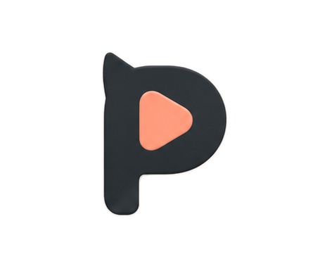

<div align="center">



# Pawcast

**A modern desktop audio/video loop player with A-B repeat & a Shadowing Recorder.**

Loop YouTube videos and local media with precision, transcribe with AI, and record your voice to master pronunciation — built for language learners, musicians, and content reviewers.

<p>
  <a href="https://github.com/mxggle/pawcast/releases"></a>
  <a href="#-license"></a>
  
  
  
  
  
</p>

<p>
  🎯 <b>Supports</b> MP3 · MP4 · WebM · FLAC · YouTube &nbsp;•&nbsp;
  📼 <b>Input</b> Drag &amp; drop or paste a URL &nbsp;•&nbsp;
  🔁 <b>Loop</b> Custom A-B points &nbsp;•&nbsp;
  🎙️ <b>Shadow</b> Record &amp; compare your voice
</p>

</div>


## 📚 Table of Contents

- [Features](#-features)
- [Architecture](#-architecture)
- [Tech Stack](#-tech-stack)
- [Getting Started](#-getting-started)
- [Usage](#-usage)
- [Keyboard Shortcuts](#️-keyboard-shortcuts)
- [Landing Page](#-landing-page)
- [License](#-license)

## ✨ Features

### Core Playback
- **Audio/Video Playback**: Robust support for local media files and YouTube videos.
- **A-B Loop**: Precise loop points with start/end markers and fine-tuning controls.
- **Waveform Visualization**: Interactive, zoomable waveform for precise navigation and loop setting, with background analysis and caching for large files.
- **Playback Speed**: Adjustable playback rate (0.25x – 2.0x) without altering pitch.
- **Bookmarks**: Save important timestamps with notes for quick access.
- **Persistent Player**: Playback state survives page navigation; a mini-player keeps your session alive across routes.

### 🎙️ Shadowing & Recording
Designed for language learners to practice speaking:
- **Integrated Recorder**: Record your voice while the media plays.
- **Smart Overwrite**: Automatically trims or splits existing recordings if you re-record a section (non-destructive punch-in).
- **Dual Waveforms**: Visualize your recorded audio overlaid on the original track in real time.
- **Auto-Mute**: Automatically mutes previous takes while recording to prevent echo.

### 🤖 AI-Powered Transcription
- **Multi-Provider Support**: OpenAI Whisper, Groq Whisper, Google Gemini, and local Whisper (via Ollama) for offline transcription.
- **Chunked Transcription**: Long files are split into overlapping chunks for reliable, progressive transcription with progress feedback.
- **Loop-Range Transcription**: Transcribe only the current A–B selection.
- **Real-Time Sync**: Transcript segments sync to playback position and support click-to-seek.
- **Virtualized Rendering**: Smooth scrolling for transcripts with thousands of segments.

### 💬 AI Assistant & Explanation
- **Multi-Provider Chat**: OpenAI, Google Gemini, xAI Grok, DeepSeek, OpenCode, and Ollama.
- **Contextual Explanations**: Select any transcript segment and ask the AI for grammar, vocabulary, or cultural explanations tailored to language learners.
- **Customizable Models**: Per-provider model selection, API key management, and connection testing.

### 🧠 Sentence Practice & Glossary
- **Sentence Practice Mode**: Isolate individual transcript sentences for focused listening and repetition.
- **Glossary**: Build a personal vocabulary list from transcript selections.

### User Experience
- **Resizable Workspace**: Free-form panel layout — resize, collapse, and arrange transcript, video, and timeline panels.
- **Dark/Light Theme**: Automatic or manual theme switching.
- **Keyboard Shortcuts**: Comprehensive hotkeys for mouse-free operation.
- **Privacy First**: All data stays on your machine in the local `PawcastData` directory with journaled, checksum-verified writes.
- **Internationalization**: Full UI translations in English, 日本語, and 中文.

## 🏗 Architecture

Pawcast is a **desktop app** (Tauri 2) built from a Vite + React codebase. A typed `DesktopAPI` boundary keeps shared components, stores, repositories, and services independent from Tauri transport details, and lets the app run in a plain browser during development. See [docs/platform-architecture.md](docs/platform-architecture.md).

```
┌─────────────────────────────────────────────────────────────────────┐
│                     Layer 4 · Entry Points                          │
│                                                                     │
│   pages/*                        src-tauri/src/*                    │
│   components/layout/AppLayout.tsx  ← single platform branch here    │
└───────────────┬─────────────────────────┬───────────────────────────┘
                │                         │
                ▼                         ▼
┌─────────────────────────────────────────────────────────────────────┐
│                   Layer 3 · Desktop UI                              │
│                                                                     │
│   components/desktop/                                               │
│   ├ DesktopAppLayout   ├ DesktopFileOpener                          │
│   ├ FolderBrowser      └ PlayHistory                                │
│                                                                     │
│   DesktopAPI only   (components/web/ holds the browser dev shell)   │
└───────────────────────────────┬─────────────────────────────────────┘
                                ▼
┌─────────────────────────────────────────────────────────────────────┐
│                   Layer 2 · Shared UI & State                       │
│                                                                     │
│   components/layout/AppLayoutBase.tsx   (shared chrome)             │
│   components/ui/         Radix UI primitives                        │
│   components/player/     Playback, timeline & A-B loop controls     │
│   components/transcript/ components/waveform/                       │
│   stores/playerStore.ts  hooks/                                     │
│                                                                     │
│   No Tauri imports · No platform UI imports                         │
└───────────────────────────────┬─────────────────────────────────────┘
                                ▼
┌─────────────────────────────────────────────────────────────────────┐
│                     Layer 1 · Core (Pure)                           │
│                                                                     │
│   platform/desktop/types.ts  ← native capability contract          │
│   platform/runtime.ts        ← runtime selection                    │
│   utils/   services/   types/   i18n/                               │
│                                                                     │
│   No DOM APIs · No platform-specific calls                          │
└─────────────────────────────────────────────────────────────────────┘
```

**How it works at runtime:**

- `AppLayout.tsx` selects `DesktopAppLayout` (or the `WebAppLayout` dev fallback) through `isDesktop()`.
- All pages use `<AppLayout>` and remain platform-neutral.
- `src/platform/desktop/tauriDesktop.ts` is the only frontend Tauri adapter.
- Rust commands provide persistence, migration, filesystem watching, seekable local media, provider HTTP requests, waveform analysis, and auxiliary windows.
- Zustand uses `desktopStorage` on Tauri (`localStorage` in browser dev).

## 🛠 Tech Stack

- **Frontend**: React 18, TypeScript, Vite
- **Routing**: React Router v7
- **Styling**: Tailwind CSS, Radix UI Themes, Framer Motion
- **State**: Zustand (with persistent storage and platform-aware adapters)
- **Data Fetching & Virtualization**: TanStack Query, TanStack Virtual
- **Audio**: Web Audio API, Tone.js
- **Desktop**: Tauri 2.11, Rust 1.92+, FFmpeg/FFprobe sidecars
- **AI SDKs**: OpenAI, Google GenAI, `@ai-sdk/xai` (Grok), custom adapters for DeepSeek / OpenCode / Ollama
- **i18n**: i18next + react-i18next + browser language detector

## 🚀 Getting Started

### Prerequisites

- Node.js 20+
- npm 10+
- Rust 1.92+ and the [Tauri platform prerequisites](https://v2.tauri.app/start/prerequisites/)

### Desktop App (Tauri)

```bash
git clone https://github.com/yourusername/pawcast.git
cd pawcast
npm install

# Dev mode with hot reload
npm run dev:tauri

# Browser-only dev server (no native features; for quick UI iteration)
npm run dev

# Build and package for the current platform
npm run build:tauri

# Verify TypeScript, Rust, and sidecars
npm test
npm run check:tauri
npm run verify:sidecars
```

`npm run build:tauri` copies the platform-specific FFmpeg and FFprobe binaries supplied by the installer packages into Tauri's required target-triple names before packaging. Build each release artifact on its target operating system.

When upgrading from desktop `1.0.0-beta.3`, Pawcast discovers the existing data-directory pointer and imports canonical data and settings without deleting the source. Older installations should run `1.0.0-beta.3` once first so browser-origin data is written into `PawcastData`.

## 🎛 Usage

1. **Load Media**: Drag & drop a file or paste a YouTube link.
2. **Looping**:
   - Press **A** to set start, **B** to set end.
   - Press **L** to toggle loop.
3. **Shadowing**:
   - Click the **Mic** icon to enable Shadowing Mode.
   - Press **R** or click the Record button to start/stop recording.
   - Your recording is visualized in **Red** over the original **Green** waveform.
   - Use the volume sliders to balance original audio and your recording.
4. **AI Transcription**:
   - Open the **Transcript** panel and choose a provider in **Settings → AI**.
   - Click **Transcribe** to generate a timestamped transcript.
   - Click any sentence to jump to that timestamp.
5. **AI Explanation**:
   - Select any transcript text and click **Explain**.
   - The AI provides grammar, vocabulary, or cultural context tailored to language learners.

## ⌨️ Keyboard Shortcuts

| Key | Action |
| :--- | :--- |
| **Space** | Play/Pause |
| **A** | Set Loop Start (A) |
| **B** | Set Loop End (B) |
| **L** | Toggle Loop |
| **C** | Clear Loop Points |
| **R** | Start/Stop Recording (Shadowing) |
| **M** | Add Bookmark |
| **← / →** | Seek -5s / +5s |
| **Shift + ← / →** | Seek -1s / +1s |
| **↑ / ↓** | Volume Up / Down |

## 🌐 Landing Page

An interactive marketing site lives in [`website/`](website/) — a self-contained,
single-file `index.html` (no build step) that acts as a **digital twin** of the app.
It walks through every product feature with live, hands-on demos rather than static screenshots:

- A working **A-B loop player** with draggable A/B handles, click-to-seek, play/loop, and speed controls.
- A **transcript panel** with click-to-seek words, a select-to-explain AI panel (streamed), and inline translation toggle.
- **Shadowing**, **Sentence Practice**, and **Glossary** mockups driven by real interactions.
- A **live theme switcher** (six presets + dark mode) that recolors the entire page, mirroring the app's runtime theme tokens.

Preview it locally by serving the folder statically:

```bash
npx serve website
# then open the printed URL (e.g. http://localhost:3000)
```

## 📝 License

MIT License. See [LICENSE](LICENSE) for details.
